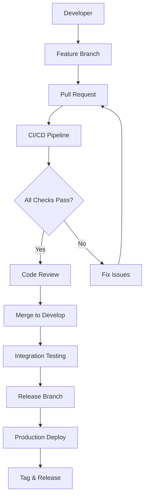

# Design Document

## Overview

このドキュメントでは、MamapaceプロジェクトにGitHub ワークフローのベストプラクティスを実装するための包括的な設計を定義します。Git Flowベースのブランチ戦略、GitHub Actions CI/CD、Issue/PRテンプレート、コミット規約の実装により、開発プロセスの標準化と自動化を実現します。

## Architecture

### ワークフロー全体構成



### ブランチ戦略設計

```mermaid
gitgraph
    commit id: "Initial"
    branch develop
    checkout develop
    commit id: "Dev Setup"
    
    branch feature/auth
    checkout feature/auth
    commit id: "Auth Feature"
    
    checkout develop
    merge feature/auth
    
    branch release/v1.0.0
    checkout release/v1.0.0
    commit id: "Release Prep"
    
    checkout main
    merge release/v1.0.0
    commit id: "v1.0.0" tag: "v1.0.0"
    
    checkout develop
    merge main
```

## Components and Interfaces

### 1. GitHub Actions CI/CD Pipeline

#### ワークフローファイル構成
- `.github/workflows/ci.yml` - メインCI/CDパイプライン
- `.github/workflows/release.yml` - リリース自動化
- `.github/workflows/security.yml` - セキュリティチェック

#### CI/CDステージ設計

```yaml
# CI/CDパイプラインの主要ステージ
stages:
  - lint_and_format:
      - ESLint静的解析
      - Prettier フォーマットチェック
      - TypeScript型チェック
  
  - test:
      - Jest単体テスト実行
      - React Native Testing Library
      - カバレッジレポート生成
  
  - build:
      - Web版ビルド (npm run build:web)
      - iOS/Android ビルド検証
      - アセット最適化
  
  - security:
      - npm audit (依存関係脆弱性)
      - CodeQL静的解析
      - Secrets検出
  
  - deploy:
      - ステージング環境デプロイ (develop)
      - 本番環境デプロイ (main)
```

### 2. ブランチ保護とルール

#### ブランチ保護設定
```json
{
  "main": {
    "protection": {
      "required_status_checks": ["ci/lint", "ci/test", "ci/build"],
      "enforce_admins": true,
      "required_pull_request_reviews": {
        "required_approving_review_count": 2,
        "dismiss_stale_reviews": true
      },
      "restrictions": null,
      "allow_force_pushes": false,
      "allow_deletions": false
    }
  },
  "develop": {
    "protection": {
      "required_status_checks": ["ci/lint", "ci/test"],
      "required_pull_request_reviews": {
        "required_approving_review_count": 1
      }
    }
  }
}
```

### 3. Issue管理システム

#### Issueテンプレート構成
- `bug_report.yml` - バグレポート用構造化テンプレート
- `feature_request.yml` - 機能リクエスト用テンプレート
- `config.yml` - Issue設定とラベル自動化

#### ラベル自動化システム
```yaml
# ラベル自動適用ルール
label_automation:
  - pattern: "feat:"
    labels: ["enhancement", "priority: medium"]
  - pattern: "fix:"
    labels: ["bug", "priority: high"]
  - pattern: "docs:"
    labels: ["documentation", "priority: low"]
  - files_changed: ["src/components/**"]
    labels: ["component: ui"]
  - files_changed: ["src/services/**"]
    labels: ["component: backend"]
```

### 4. プルリクエスト管理

#### PRテンプレート設計
- 標準化されたチェックリスト
- 自動リンク機能（Issue番号からの自動紐付け）
- レビュアー自動アサイン
- ステータスチェック統合

#### 自動レビュアーアサイン
```yaml
# CODEOWNERS設定
# Global owners
* @team-lead @senior-dev

# Frontend components
src/components/ @frontend-team @ui-specialist

# Backend services  
src/services/ @backend-team @api-specialist

# Documentation
docs/ @tech-writer @team-lead

# CI/CD configurations
.github/ @devops-team @team-lead
```

## Data Models

### 1. ワークフロー設定データ

```typescript
interface WorkflowConfig {
  name: string;
  triggers: {
    push: string[];
    pull_request: string[];
    schedule?: string;
  };
  jobs: Job[];
}

interface Job {
  name: string;
  runs_on: string;
  steps: Step[];
  needs?: string[];
  if?: string;
}

interface Step {
  name: string;
  uses?: string;
  run?: string;
  with?: Record<string, string>;
  env?: Record<string, string>;
}
```

### 2. ブランチ管理データ

```typescript
interface BranchStrategy {
  main: BranchConfig;
  develop: BranchConfig;
  feature: BranchPattern;
  bugfix: BranchPattern;
  hotfix: BranchPattern;
  release: BranchPattern;
}

interface BranchConfig {
  protection: {
    required_status_checks: string[];
    required_reviews: number;
    dismiss_stale_reviews: boolean;
    enforce_admins: boolean;
  };
}

interface BranchPattern {
  prefix: string;
  naming_convention: string;
  auto_delete: boolean;
}
```

### 3. Issue/PRテンプレートデータ

```typescript
interface IssueTemplate {
  name: string;
  description: string;
  title: string;
  labels: string[];
  body: FormField[];
}

interface FormField {
  type: 'input' | 'textarea' | 'dropdown' | 'checkboxes';
  id: string;
  attributes: {
    label: string;
    description?: string;
    placeholder?: string;
    options?: string[];
    multiple?: boolean;
  };
  validations: {
    required: boolean;
  };
}
```

## Error Handling

### 1. CI/CDエラー処理

#### ビルド失敗時の対応
```yaml
# エラー通知とリトライ機能
on_failure:
  - name: Notify on Slack
    uses: 8398a7/action-slack@v3
    with:
      status: failure
      text: "Build failed for ${{ github.ref }}"
  
  - name: Create Issue on Failure
    uses: actions/github-script@v6
    with:
      script: |
        github.rest.issues.create({
          owner: context.repo.owner,
          repo: context.repo.repo,
          title: `CI/CD Failure: ${context.workflow}`,
          body: `Build failed on ${context.ref}`,
          labels: ['bug', 'ci/cd', 'priority: high']
        })
```

#### テスト失敗時の詳細レポート
```yaml
- name: Test Report
  uses: dorny/test-reporter@v1
  if: success() || failure()
  with:
    name: Jest Tests
    path: 'test-results.xml'
    reporter: jest-junit
    fail-on-error: true
```

### 2. ブランチ保護違反の処理

```typescript
// ブランチ保護違反時の自動対応
const handleProtectionViolation = {
  direct_push_to_main: {
    action: 'block',
    message: 'Direct push to main is not allowed. Please create a pull request.',
    create_issue: true
  },
  insufficient_reviews: {
    action: 'block', 
    message: 'This PR requires at least 2 approving reviews.',
    notify_reviewers: true
  },
  failing_status_checks: {
    action: 'block',
    message: 'All status checks must pass before merging.',
    retry_option: true
  }
};
```

### 3. テンプレート検証エラー

```yaml
# Issue/PRテンプレートの検証
template_validation:
  required_fields:
    - title
    - description
    - reproduction_steps (for bugs)
    - acceptance_criteria (for features)
  
  validation_rules:
    - title_min_length: 10
    - description_min_length: 50
    - labels_required: true
    - assignee_required: false
```

## Testing Strategy

### 1. ワークフロー自動テスト

#### GitHub Actions テスト
```yaml
# ワークフロー自体のテスト
name: Test Workflows
on:
  pull_request:
    paths: ['.github/workflows/**']

jobs:
  validate-workflows:
    runs-on: ubuntu-latest
    steps:
      - uses: actions/checkout@v4
      - name: Validate workflow syntax
        run: |
          for workflow in .github/workflows/*.yml; do
            echo "Validating $workflow"
            yamllint "$workflow"
          done
```

#### ブランチ戦略テスト
```bash
#!/bin/bash
# test-branch-strategy.sh

# テストシナリオ
test_feature_branch_creation() {
  git checkout develop
  git checkout -b feature/test-feature
  assert_branch_exists "feature/test-feature"
}

test_pr_requirements() {
  # PRが必要なチェックを満たしているかテスト
  assert_status_check_required "ci/lint"
  assert_status_check_required "ci/test"
  assert_review_required 1
}

test_merge_restrictions() {
  # mainブランチへの直接プッシュが禁止されているかテスト
  assert_direct_push_blocked "main"
  assert_direct_push_blocked "develop"
}
```

### 2. テンプレート機能テスト

#### Issue テンプレートテスト
```typescript
// Issue作成時のテンプレート適用テスト
describe('Issue Templates', () => {
  test('Bug report template includes required fields', () => {
    const template = loadIssueTemplate('bug_report');
    expect(template.body).toContainField('reproduction_steps');
    expect(template.body).toContainField('expected_behavior');
    expect(template.body).toContainField('actual_behavior');
    expect(template.labels).toContain('bug');
  });

  test('Feature request template includes acceptance criteria', () => {
    const template = loadIssueTemplate('feature_request');
    expect(template.body).toContainField('acceptance_criteria');
    expect(template.body).toContainField('motivation');
    expect(template.labels).toContain('enhancement');
  });
});
```

#### PR テンプレートテスト
```typescript
describe('PR Templates', () => {
  test('PR template includes all required sections', () => {
    const template = loadPRTemplate();
    expect(template).toContainSection('変更内容');
    expect(template).toContainSection('テスト');
    expect(template).toContainSection('動作確認');
    expect(template).toContainCheckbox('iOS');
    expect(template).toContainCheckbox('Android');
    expect(template).toContainCheckbox('Web');
  });
});
```

### 3. 統合テスト

#### エンドツーエンドワークフローテスト
```yaml
# 完全なワークフローテスト
name: E2E Workflow Test
on:
  schedule:
    - cron: '0 2 * * *'  # 毎日午前2時に実行

jobs:
  test-complete-workflow:
    runs-on: ubuntu-latest
    steps:
      - name: Create test feature branch
        run: git checkout -b feature/e2e-test-$(date +%s)
      
      - name: Make test changes
        run: echo "test" > test-file.txt
      
      - name: Create PR
        uses: peter-evans/create-pull-request@v5
        with:
          title: "E2E Test PR"
          body: "Automated E2E workflow test"
      
      - name: Verify CI/CD triggers
        run: |
          # CI/CDが正常に実行されることを確認
          gh pr checks --watch
      
      - name: Clean up
        run: |
          gh pr close --delete-branch
```

## Implementation Considerations

### 1. 段階的導入戦略

#### Phase 1: 基本CI/CD
- ESLint, TypeScript, テスト実行の基本パイプライン
- 基本的なブランチ保護設定

#### Phase 2: 高度な自動化
- 自動レビュアーアサイン
- ラベル自動化
- セキュリティスキャン

#### Phase 3: 最適化と監視
- パフォーマンス監視
- メトリクス収集
- ワークフロー最適化

### 2. チーム教育とドキュメント

#### 開発者向けガイド
- ブランチ戦略の使い方
- コミットメッセージ規約
- PR作成のベストプラクティス

#### 管理者向けガイド
- ワークフロー設定の管理
- ブランチ保護ルールの調整
- メトリクス分析

### 3. 監視とメトリクス

#### 収集すべきメトリクス
- CI/CD実行時間と成功率
- PR作成からマージまでの時間
- コードレビューの品質指標
- デプロイ頻度とリードタイム

#### アラート設定
- CI/CD失敗時の即座通知
- セキュリティ脆弱性検出時の緊急通知
- 長時間未レビューPRの警告

## Security Considerations

### 1. シークレット管理
- GitHub Secretsを使用した機密情報の安全な管理
- 環境別のシークレット分離
- 定期的なシークレットローテーション

### 2. 権限管理
- 最小権限の原則に基づくアクセス制御
- ブランチ保護による不正な変更の防止
- 外部コントリビューターの制限

### 3. 依存関係セキュリティ
- 自動的な脆弱性スキャン
- 依存関係の定期更新
- セキュリティアドバイザリの監視