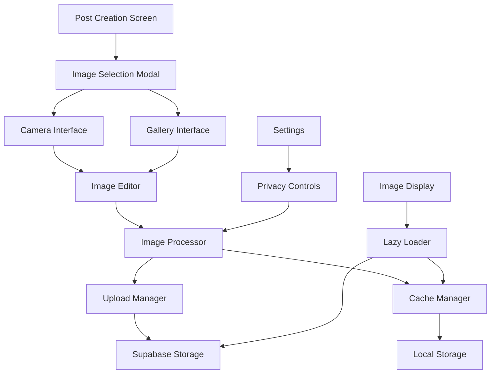

# Design Document

## Overview

The image upload system provides a comprehensive solution for image handling in the Mamapace app, designed specifically for one-handed operation during nighttime use. The system integrates with Expo's camera and media library APIs, implements efficient image processing and compression, and provides a seamless user experience optimized for mothers using the app while caring for their babies.

## Architecture

### High-Level Architecture



### System Components

1. **Image Selection Layer**: Handles camera/gallery access and permissions
2. **Image Processing Layer**: Compression, editing, and metadata handling
3. **Upload Management Layer**: Queue management, retry logic, and progress tracking
4. **Cache Management Layer**: Local storage, cleanup, and optimization
5. **Display Layer**: Lazy loading, thumbnails, and full-screen viewing

## Components and Interfaces

### Core Components

#### ImageUploadManager
```typescript
interface ImageUploadManager {
  selectImage(source: 'camera' | 'gallery'): Promise<ImageAsset[]>;
  processImage(image: ImageAsset, options: ProcessingOptions): Promise<ProcessedImage>;
  uploadImage(image: ProcessedImage): Promise<UploadResult>;
  getUploadProgress(uploadId: string): UploadProgress;
  cancelUpload(uploadId: string): void;
}
```

#### ImageProcessor
```typescript
interface ImageProcessor {
  compress(image: ImageAsset, quality: number): Promise<CompressedImage>;
  crop(image: ImageAsset, cropData: CropData): Promise<CroppedImage>;
  applyFilter(image: ImageAsset, filter: FilterType): Promise<FilteredImage>;
  stripMetadata(image: ImageAsset): Promise<CleanImage>;
  generateThumbnail(image: ImageAsset, size: ThumbnailSize): Promise<Thumbnail>;
}
```

#### CacheManager
```typescript
interface CacheManager {
  store(key: string, image: ImageData): Promise<void>;
  retrieve(key: string): Promise<ImageData | null>;
  cleanup(): Promise<void>;
  getCacheSize(): Promise<number>;
  clearCache(): Promise<void>;
}
```

#### ImageEditor Component
```typescript
interface ImageEditorProps {
  image: ImageAsset;
  onSave: (editedImage: ProcessedImage) => void;
  onCancel: () => void;
  darkMode: boolean;
  handPreference: 'left' | 'right';
}
```

### Service Integration

#### Supabase Storage Integration
```typescript
interface SupabaseImageService {
  uploadImage(image: ProcessedImage, bucket: string): Promise<UploadResult>;
  getImageUrl(path: string): string;
  deleteImage(path: string): Promise<void>;
  generateSignedUrl(path: string, expiresIn: number): Promise<string>;
}
```

#### Redux State Management
```typescript
interface ImageUploadState {
  uploads: Record<string, UploadProgress>;
  cache: ImageCacheState;
  settings: ImageSettings;
  errors: ImageError[];
}
```

## Data Models

### Core Data Types

```typescript
interface ImageAsset {
  id: string;
  uri: string;
  width: number;
  height: number;
  fileSize: number;
  mimeType: string;
  fileName?: string;
  exif?: ExifData;
}

interface ProcessedImage extends ImageAsset {
  compressed: boolean;
  compressionRatio: number;
  thumbnailUri?: string;
  altText?: string;
  processedAt: Date;
}

interface UploadProgress {
  id: string;
  status: 'pending' | 'uploading' | 'completed' | 'failed';
  progress: number;
  error?: string;
  retryCount: number;
  estimatedTimeRemaining?: number;
}

interface CropData {
  x: number;
  y: number;
  width: number;
  height: number;
  aspectRatio?: number;
}

interface FilterType {
  name: string;
  parameters: Record<string, any>;
  darkModeOptimized: boolean;
}

interface ImageSettings {
  compressionQuality: number;
  stripMetadata: boolean;
  generateThumbnails: boolean;
  maxCacheSize: number;
  autoCleanup: boolean;
}
```

### Database Schema (Supabase)

```sql
-- Image uploads table
CREATE TABLE image_uploads (
  id UUID PRIMARY KEY DEFAULT gen_random_uuid(),
  user_id UUID REFERENCES users(id) ON DELETE CASCADE,
  post_id UUID REFERENCES posts(id) ON DELETE CASCADE,
  storage_path TEXT NOT NULL,
  original_name TEXT,
  file_size INTEGER,
  mime_type TEXT,
  width INTEGER,
  height INTEGER,
  alt_text TEXT,
  upload_status TEXT DEFAULT 'completed',
  created_at TIMESTAMP WITH TIME ZONE DEFAULT NOW(),
  updated_at TIMESTAMP WITH TIME ZONE DEFAULT NOW()
);

-- Image processing metadata
CREATE TABLE image_metadata (
  id UUID PRIMARY KEY DEFAULT gen_random_uuid(),
  image_id UUID REFERENCES image_uploads(id) ON DELETE CASCADE,
  compression_ratio DECIMAL,
  filters_applied JSONB,
  thumbnail_path TEXT,
  processing_options JSONB,
  created_at TIMESTAMP WITH TIME ZONE DEFAULT NOW()
);
```

## Error Handling

### Error Types and Recovery

```typescript
enum ImageErrorType {
  PERMISSION_DENIED = 'PERMISSION_DENIED',
  CAMERA_UNAVAILABLE = 'CAMERA_UNAVAILABLE',
  GALLERY_UNAVAILABLE = 'GALLERY_UNAVAILABLE',
  PROCESSING_FAILED = 'PROCESSING_FAILED',
  UPLOAD_FAILED = 'UPLOAD_FAILED',
  NETWORK_ERROR = 'NETWORK_ERROR',
  STORAGE_FULL = 'STORAGE_FULL',
  INVALID_FORMAT = 'INVALID_FORMAT',
  FILE_TOO_LARGE = 'FILE_TOO_LARGE'
}

interface ImageError {
  type: ImageErrorType;
  message: string;
  recoverable: boolean;
  retryAction?: () => Promise<void>;
  userMessage: string;
}
```

### Error Recovery Strategies

1. **Permission Errors**: Guide user to settings with clear instructions
2. **Network Errors**: Implement exponential backoff with queue persistence
3. **Processing Errors**: Fallback to original image with user notification
4. **Storage Errors**: Automatic cache cleanup with user confirmation
5. **Upload Errors**: Retry mechanism with progress preservation

### Retry Logic

```typescript
interface RetryConfig {
  maxRetries: number;
  baseDelay: number;
  maxDelay: number;
  backoffMultiplier: number;
  retryableErrors: ImageErrorType[];
}

const DEFAULT_RETRY_CONFIG: RetryConfig = {
  maxRetries: 3,
  baseDelay: 1000,
  maxDelay: 30000,
  backoffMultiplier: 2,
  retryableErrors: [
    ImageErrorType.NETWORK_ERROR,
    ImageErrorType.UPLOAD_FAILED,
    ImageErrorType.PROCESSING_FAILED
  ]
};
```

## Testing Strategy

### Unit Testing

1. **Image Processing Tests**
   - Compression quality validation
   - Filter application accuracy
   - Metadata stripping verification
   - Thumbnail generation consistency

2. **Upload Manager Tests**
   - Queue management functionality
   - Retry logic validation
   - Progress tracking accuracy
   - Error handling completeness

3. **Cache Manager Tests**
   - Storage and retrieval operations
   - Cleanup algorithm effectiveness
   - Size limit enforcement
   - Corruption detection

### Integration Testing

1. **Expo API Integration**
   - Camera permission flow
   - Gallery access functionality
   - Image picker behavior
   - Platform-specific differences

2. **Supabase Storage Integration**
   - Upload success scenarios
   - Authentication handling
   - Error response processing
   - URL generation accuracy

3. **Redux State Integration**
   - State updates during upload
   - Error state management
   - Cache state synchronization
   - Settings persistence

### End-to-End Testing

1. **Complete Upload Flow**
   - Camera capture to upload completion
   - Gallery selection to post creation
   - Error scenarios and recovery
   - One-handed operation validation

2. **Performance Testing**
   - Large image processing time
   - Multiple simultaneous uploads
   - Cache performance under load
   - Memory usage optimization

3. **Accessibility Testing**
   - Screen reader compatibility
   - Keyboard navigation support
   - Alternative input methods
   - High contrast mode functionality

### Test Data and Mocking

```typescript
// Mock image assets for testing
const mockImageAssets = {
  smallImage: {
    uri: 'test://small-image.jpg',
    width: 800,
    height: 600,
    fileSize: 150000
  },
  largeImage: {
    uri: 'test://large-image.jpg',
    width: 4000,
    height: 3000,
    fileSize: 5000000
  },
  corruptedImage: {
    uri: 'test://corrupted.jpg',
    width: 0,
    height: 0,
    fileSize: 0
  }
};
```

## Performance Considerations

### Image Processing Optimization

1. **Compression Strategy**
   - Progressive JPEG for web compatibility
   - WebP format for supported platforms
   - Quality adjustment based on image content
   - Batch processing for multiple images

2. **Memory Management**
   - Image processing in background threads
   - Memory pool for frequent operations
   - Garbage collection optimization
   - Large image streaming processing

3. **Caching Strategy**
   - LRU cache for frequently accessed images
   - Thumbnail pre-generation
   - Progressive loading for large images
   - Cache warming for predicted usage

### Network Optimization

1. **Upload Optimization**
   - Chunked upload for large files
   - Parallel upload for multiple images
   - Bandwidth adaptation
   - Resume capability for interrupted uploads

2. **Download Optimization**
   - Progressive image loading
   - Adaptive quality based on connection
   - Prefetching for predicted views
   - CDN integration for global distribution

## Security Considerations

### Privacy Protection

1. **Metadata Stripping**
   - EXIF data removal by default
   - GPS location scrubbing
   - Camera model anonymization
   - Timestamp normalization

2. **Access Control**
   - User-specific storage buckets
   - Signed URL generation
   - Time-limited access tokens
   - Role-based permissions

### Data Protection

1. **Encryption**
   - At-rest encryption in Supabase
   - In-transit encryption (HTTPS)
   - Local cache encryption
   - Key rotation policies

2. **Validation**
   - File type validation
   - Size limit enforcement
   - Malware scanning integration
   - Content moderation hooks

## Accessibility Implementation

### Screen Reader Support

```typescript
const ImageUploadButton = () => (
  <TouchableOpacity
    accessible={true}
    accessibilityLabel="画像を追加"
    accessibilityHint="カメラまたはギャラリーから画像を選択します"
    accessibilityRole="button"
  >
    <Icon name="image-plus" />
  </TouchableOpacity>
);
```

### One-Handed Operation

1. **Control Positioning**
   - Thumb-reachable zones for primary actions
   - Hand preference adaptation
   - Gesture-based navigation
   - Voice control integration

2. **Visual Feedback**
   - High contrast mode support
   - Large touch targets (minimum 44pt)
   - Clear visual hierarchy
   - Progress indication

## Internationalization

### Text Localization

```typescript
const imageUploadTexts = {
  ja: {
    selectImage: '画像を選択',
    takePhoto: '写真を撮る',
    chooseFromGallery: 'ギャラリーから選択',
    editImage: '画像を編集',
    uploadProgress: 'アップロード中...',
    uploadComplete: 'アップロード完了',
    uploadFailed: 'アップロードに失敗しました'
  }
};
```

### Cultural Considerations

1. **Image Formats**
   - Support for regional preferences
   - Aspect ratio conventions
   - Color space considerations
   - Compression preferences

2. **User Behavior**
   - Upload timing patterns
   - Privacy expectations
   - Sharing conventions
   - Quality preferences