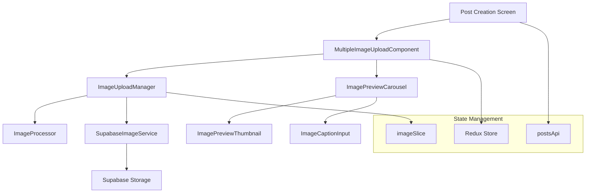

# Design Document

## Overview

複数画像投稿機能は、既存の単一画像アップロード機能を拡張し、ユーザーが一度の投稿で最大5枚の画像を選択・プレビュー・投稿できる機能です。この機能は既存の`ImageUploadManager`、`ImageUploadButton`コンポーネント、およびSupabase Storageインフラストラクチャを活用して実装されます。

## Architecture

### システム構成図



### データフロー

1. **画像選択**: ユーザーがギャラリーから複数画像を選択
2. **プレビュー表示**: 選択された画像を水平スクロール可能なカルーセルで表示
3. **画像管理**: 個別削除、並び替え、キャプション追加
4. **アップロード**: 投稿時に全画像を並列アップロード
5. **投稿作成**: アップロードされた画像URLを含む投稿データを作成

## Components and Interfaces

### 1. MultipleImageUploadComponent

既存の`ImageUploadButton`を拡張した新しいコンポーネント。

```typescript
interface MultipleImageUploadProps {
  onImagesSelected: (images: ImageAsset[]) => void;
  onImageRemoved: (imageId: string) => void;
  selectedImages: ImageAsset[];
  maxImages?: number; // デフォルト: 5
  disabled?: boolean;
  showPreview?: boolean;
}
```

**主要機能:**
- 複数画像選択（expo-image-picker使用）
- 最大枚数制限（5枚）
- 選択画像のプレビュー表示
- 個別画像の削除機能

### 2. ImagePreviewCarousel

選択された画像のプレビューを表示するカルーセルコンポーネント。

```typescript
interface ImagePreviewCarouselProps {
  images: ImageAsset[];
  onImageRemove: (imageId: string) => void;
  onImageReorder: (fromIndex: number, toIndex: number) => void;
  onCaptionChange: (imageId: string, caption: string) => void;
  editable?: boolean;
}
```

**主要機能:**
- 水平スクロール可能なサムネイル表示
- ドラッグ&ドロップによる並び替え
- 個別画像の削除ボタン
- キャプション入力機能

### 3. ImagePreviewThumbnail

個別画像のサムネイル表示コンポーネント。

```typescript
interface ImagePreviewThumbnailProps {
  image: ImageAsset;
  caption?: string;
  onRemove: () => void;
  onCaptionChange: (caption: string) => void;
  onPress: () => void;
  editable?: boolean;
  size?: 'small' | 'medium' | 'large';
}
```

**主要機能:**
- サムネイル画像表示（80x80dp）
- 削除ボタン（X）
- キャプション表示・編集
- タップで拡大表示

### 4. ImageCaptionInput

画像キャプション入力用のモーダルコンポーネント。

```typescript
interface ImageCaptionInputProps {
  visible: boolean;
  image: ImageAsset;
  initialCaption?: string;
  onSave: (caption: string) => void;
  onCancel: () => void;
  maxLength?: number; // デフォルト: 100
}
```

## Data Models

### 拡張されたImageAsset型

```typescript
interface ImageAssetWithCaption extends ImageAsset {
  caption?: string;
  order: number; // 表示順序
  uploadStatus?: 'pending' | 'uploading' | 'completed' | 'failed';
  uploadProgress?: number;
}
```

### 投稿データ構造

```typescript
interface PostWithImages {
  id: string;
  content: string;
  userId: string;
  images?: PostImage[];
  createdAt: Date;
}

interface PostImage {
  id: string;
  url: string;
  caption?: string;
  order: number;
  width: number;
  height: number;
}
```

### Redux State拡張

```typescript
interface MultipleImageUploadState {
  selectedImages: ImageAssetWithCaption[];
  uploadProgress: Record<string, UploadProgress>;
  isUploading: boolean;
  errors: ImageError[];
}
```

## Error Handling

### エラー種別

1. **選択エラー**
   - 最大枚数超過
   - サポートされていないファイル形式
   - ファイルサイズ超過

2. **アップロードエラー**
   - ネットワークエラー
   - ストレージ容量不足
   - 認証エラー

3. **処理エラー**
   - 画像処理失敗
   - メモリ不足

### エラー処理戦略

```typescript
class MultipleImageUploadErrorHandler {
  handleSelectionError(error: ImageError): void;
  handleUploadError(imageId: string, error: ImageError): void;
  retryFailedUploads(): Promise<void>;
  showUserFriendlyError(error: ImageError): void;
}
```

**リトライ機能:**
- 失敗した画像のみ個別リトライ
- 最大3回まで自動リトライ
- 指数バックオフによる遅延

## Testing Strategy

### 単体テスト

1. **MultipleImageUploadComponent**
   - 画像選択機能
   - 最大枚数制限
   - エラーハンドリング

2. **ImagePreviewCarousel**
   - 画像表示
   - 並び替え機能
   - 削除機能

3. **ImageUploadManager拡張**
   - 複数画像処理
   - 並列アップロード
   - プログレス管理

### 統合テスト

1. **エンドツーエンドフロー**
   - 画像選択から投稿完了まで
   - エラー発生時の復旧
   - ネットワーク切断時の動作

2. **パフォーマンステスト**
   - 大容量画像の処理
   - 複数画像同時アップロード
   - メモリ使用量

### アクセシビリティテスト

1. **スクリーンリーダー対応**
   - 画像の代替テキスト
   - 操作ボタンのラベル
   - 状態の音声フィードバック

2. **キーボードナビゲーション**
   - タブ順序
   - フォーカス管理
   - ショートカットキー

## Performance Considerations

### 最適化戦略

1. **画像処理最適化**
   - 並列処理による高速化
   - プログレッシブ読み込み
   - サムネイル生成の最適化

2. **メモリ管理**
   - 大容量画像の段階的読み込み
   - 不要な画像データの解放
   - キャッシュサイズの制限

3. **ネットワーク最適化**
   - 並列アップロード（最大3並列）
   - 失敗時の自動リトライ
   - プログレス表示による UX向上

### パフォーマンス指標

- 画像選択から表示まで: < 500ms
- サムネイル生成: < 200ms/画像
- アップロード開始まで: < 1秒
- 5枚画像の総アップロード時間: < 30秒（良好なネットワーク環境）

## Security Considerations

### データ保護

1. **画像メタデータ除去**
   - EXIF情報の自動削除
   - 位置情報の除去
   - 個人情報の保護

2. **アップロード制限**
   - ファイル形式の検証
   - ファイルサイズ制限（10MB/画像）
   - ウイルススキャン（将来実装）

3. **アクセス制御**
   - 認証済みユーザーのみアップロード可能
   - RLSポリシーによるデータ保護
   - 適切なCORS設定

## Implementation Phases

### Phase 1: 基本機能実装
- MultipleImageUploadComponent作成
- ImagePreviewCarousel実装
- 基本的な選択・削除機能

### Phase 2: 高度な機能
- ドラッグ&ドロップ並び替え
- キャプション機能
- プログレス表示

### Phase 3: 最適化・テスト
- パフォーマンス最適化
- エラーハンドリング強化
- アクセシビリティ対応

### Phase 4: 統合・デプロイ
- 既存投稿システムとの統合
- E2Eテスト実行
- 本番環境デプロイ