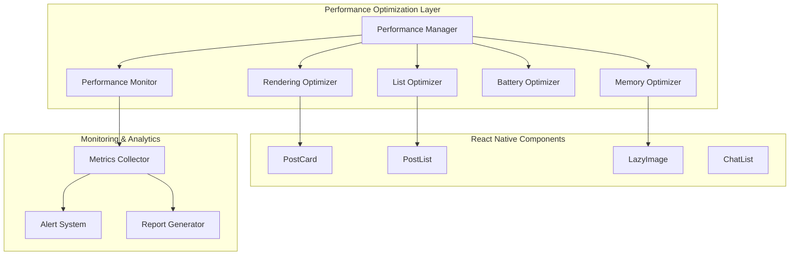

# 設計書

## 概要

Mamapaceアプリのパフォーマンス最適化システムは、React Nativeアプリケーションの性能向上を目的とした包括的な最適化フレームワークです。レンダリング、リスト表示、メモリ管理、バッテリー効率、パフォーマンス監視の5つの主要領域で最適化を実施します。

## アーキテクチャ

### システム構成図



## コンポーネントと インターフェース

### 1. Performance Manager

**責任**: パフォーマンス最適化システム全体の統括管理

```typescript
interface PerformanceManager {
  initialize(): Promise<void>;
  enableOptimizations(): void;
  disableOptimizations(): void;
  getPerformanceReport(): PerformanceReport;
  configureThresholds(config: PerformanceConfig): void;
}

interface PerformanceConfig {
  fpsThreshold: number;
  memoryThreshold: number;
  renderTimeThreshold: number;
  batteryOptimizationEnabled: boolean;
}
```

### 2. Rendering Optimizer

**責任**: React コンポーネントのレンダリング最適化

```typescript
interface RenderingOptimizer {
  optimizeComponent<T>(component: React.ComponentType<T>): React.ComponentType<T>;
  memoizeExpensiveCalculations<T>(fn: (...args: any[]) => T): (...args: any[]) => T;
  preventUnnecessaryRerenders(component: React.ComponentType): React.ComponentType;
  measureRenderTime(componentName: string): void;
}

// HOC for automatic optimization
const withPerformanceOptimization = <P extends object>(
  Component: React.ComponentType<P>
): React.ComponentType<P> => {
  return React.memo(Component, (prevProps, nextProps) => {
    // Custom comparison logic
    return shallowEqual(prevProps, nextProps);
  });
};
```

### 3. List Optimizer

**責任**: FlatListとScrollViewの仮想化とパフォーマンス最適化

```typescript
interface ListOptimizer {
  createOptimizedFlatList<T>(config: OptimizedListConfig<T>): React.ComponentType;
  calculateItemLayout(data: any[], index: number): { length: number; offset: number; index: number };
  enableVirtualization(listRef: React.RefObject<FlatList>): void;
  preloadNextPage(currentIndex: number, totalItems: number): void;
}

interface OptimizedListConfig<T> {
  data: T[];
  renderItem: ({ item, index }: { item: T; index: number }) => React.ReactElement;
  keyExtractor: (item: T, index: number) => string;
  estimatedItemSize: number;
  windowSize: number;
  maxToRenderPerBatch: number;
}
```

### 4. Memory Optimizer

**責任**: メモリ使用量の監視と最適化

```typescript
interface MemoryOptimizer {
  monitorMemoryUsage(): MemoryUsageInfo;
  optimizeImageMemory(imageUri: string, targetSize: ImageSize): Promise<string>;
  clearUnusedCache(): Promise<void>;
  enableGarbageCollection(): void;
  setMemoryWarningThreshold(threshold: number): void;
}

interface MemoryUsageInfo {
  totalMemory: number;
  usedMemory: number;
  availableMemory: number;
  cacheSize: number;
  imageMemoryUsage: number;
}

interface ImageSize {
  width: number;
  height: number;
  quality?: number;
}
```

### 5. Battery Optimizer

**責任**: バッテリー消費の最適化

```typescript
interface BatteryOptimizer {
  enablePowerSaveMode(): void;
  disablePowerSaveMode(): void;
  optimizeBackgroundTasks(): void;
  reduceAnimationFrameRate(): void;
  optimizeNetworkRequests(): void;
  getBatteryUsageReport(): BatteryUsageReport;
}

interface BatteryUsageReport {
  cpuUsage: number;
  networkActivity: number;
  screenBrightness: number;
  backgroundTasksCount: number;
  estimatedBatteryLife: number;
}
```

### 6. Performance Monitor

**責任**: パフォーマンス指標の監視とレポート生成

```typescript
interface PerformanceMonitor {
  startMonitoring(): void;
  stopMonitoring(): void;
  recordMetric(name: string, value: number, tags?: Record<string, string>): void;
  getMetrics(timeRange: TimeRange): PerformanceMetrics;
  generateReport(): PerformanceReport;
  setAlertThresholds(thresholds: AlertThresholds): void;
}

interface PerformanceMetrics {
  fps: number[];
  renderTimes: number[];
  memoryUsage: number[];
  networkLatency: number[];
  userInteractionDelay: number[];
}

interface AlertThresholds {
  lowFPS: number;
  highMemoryUsage: number;
  slowRenderTime: number;
  highNetworkLatency: number;
}
```

## データモデル

### Performance Configuration

```typescript
interface PerformanceSettings {
  id: string;
  userId: string;
  renderingOptimization: {
    enabled: boolean;
    memoizationLevel: 'basic' | 'aggressive';
    rerenderThreshold: number;
  };
  listOptimization: {
    enabled: boolean;
    virtualizationEnabled: boolean;
    windowSize: number;
    maxToRenderPerBatch: number;
  };
  memoryOptimization: {
    enabled: boolean;
    imageCompressionLevel: number;
    cacheSize: number;
    garbageCollectionInterval: number;
  };
  batteryOptimization: {
    enabled: boolean;
    powerSaveMode: boolean;
    backgroundTaskLimitation: boolean;
  };
  monitoring: {
    enabled: boolean;
    metricsCollectionInterval: number;
    alertsEnabled: boolean;
  };
}
```

### Performance Metrics Data

```typescript
interface PerformanceMetricsData {
  timestamp: Date;
  sessionId: string;
  userId: string;
  deviceInfo: {
    platform: string;
    version: string;
    memory: number;
    cpu: string;
  };
  metrics: {
    fps: number;
    renderTime: number;
    memoryUsage: number;
    batteryLevel: number;
    networkLatency: number;
    userInteractionDelay: number;
  };
  context: {
    screenName: string;
    userAction: string;
    dataSize: number;
  };
}
```

## エラーハンドリング

### Performance Error Types

```typescript
enum PerformanceErrorType {
  LOW_FPS = 'LOW_FPS',
  HIGH_MEMORY_USAGE = 'HIGH_MEMORY_USAGE',
  SLOW_RENDER = 'SLOW_RENDER',
  MEMORY_LEAK = 'MEMORY_LEAK',
  BATTERY_DRAIN = 'BATTERY_DRAIN'
}

class PerformanceError extends Error {
  constructor(
    public type: PerformanceErrorType,
    public metrics: PerformanceMetrics,
    public context: string,
    message: string
  ) {
    super(message);
    this.name = 'PerformanceError';
  }
}
```

### Error Recovery Strategies

```typescript
interface ErrorRecoveryStrategy {
  handleLowFPS(): void;
  handleHighMemoryUsage(): void;
  handleSlowRender(): void;
  handleMemoryLeak(): void;
  handleBatteryDrain(): void;
}

class PerformanceErrorRecovery implements ErrorRecoveryStrategy {
  handleLowFPS(): void {
    // Reduce animation complexity
    // Lower render quality temporarily
    // Disable non-essential visual effects
  }
  
  handleHighMemoryUsage(): void {
    // Clear image cache
    // Force garbage collection
    // Reduce list window size
  }
  
  handleSlowRender(): void {
    // Enable aggressive memoization
    // Reduce component complexity
    // Defer non-critical renders
  }
  
  handleMemoryLeak(): void {
    // Identify leaking components
    // Force cleanup of event listeners
    // Reset component state
  }
  
  handleBatteryDrain(): void {
    // Enable power save mode
    // Reduce background tasks
    // Lower screen refresh rate
  }
}
```

## テスト戦略

### Performance Testing Framework

```typescript
interface PerformanceTestSuite {
  testRenderingPerformance(): Promise<TestResult>;
  testListScrollingPerformance(): Promise<TestResult>;
  testMemoryUsage(): Promise<TestResult>;
  testBatteryConsumption(): Promise<TestResult>;
  runFullPerformanceTest(): Promise<PerformanceTestReport>;
}

interface TestResult {
  passed: boolean;
  metrics: PerformanceMetrics;
  issues: PerformanceIssue[];
  recommendations: string[];
}

interface PerformanceIssue {
  type: PerformanceErrorType;
  severity: 'low' | 'medium' | 'high' | 'critical';
  description: string;
  affectedComponents: string[];
  suggestedFix: string;
}
```

### Automated Performance Testing

```typescript
class PerformanceTestRunner {
  async runRenderingTests(): Promise<void> {
    // Test component render times
    // Measure FPS during interactions
    // Check for unnecessary re-renders
  }
  
  async runMemoryTests(): Promise<void> {
    // Monitor memory usage over time
    // Test for memory leaks
    // Validate garbage collection
  }
  
  async runBatteryTests(): Promise<void> {
    // Measure CPU usage
    // Monitor network activity
    // Test power consumption
  }
}
```

## 実装の考慮事項

### 1. プラットフォーム固有の最適化

- **iOS**: Metal API活用、Core Animation最適化
- **Android**: Vulkan API対応、ART最適化
- **Web**: WebGL活用、Service Worker最適化

### 2. デバイス性能に応じた動的調整

```typescript
interface DeviceCapability {
  tier: 'low' | 'medium' | 'high';
  memory: number;
  cpu: string;
  gpu: string;
}

class AdaptivePerformanceManager {
  adjustSettingsForDevice(capability: DeviceCapability): PerformanceSettings {
    // デバイス性能に応じて最適化レベルを調整
  }
}
```

### 3. ユーザー体験への影響最小化

- 最適化処理はバックグラウンドで実行
- ユーザー操作を優先してパフォーマンス調整
- 段階的な最適化適用でスムーズな移行

### 4. 開発者向けツール

```typescript
interface PerformanceDevTools {
  enableDebugMode(): void;
  showPerformanceOverlay(): void;
  exportPerformanceData(): string;
  simulatePerformanceIssues(): void;
}
```

この設計により、Mamapaceアプリは母親ユーザーの夜間利用シーンでも快適なパフォーマンスを提供し、バッテリー効率も最適化された状態で動作します。