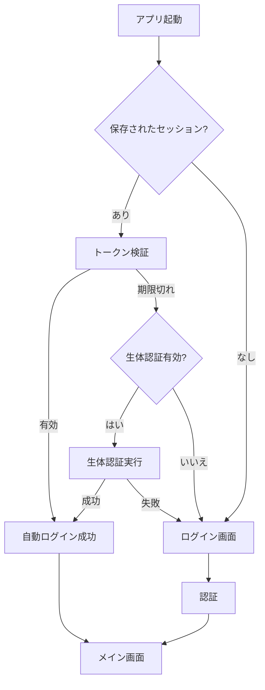

# Mamaspace - 母親向けコミュニティアプリ

React Native + Expo + Supabaseで構築された母親向けのソーシャルコミュニティアプリです。

## 🔐 認証システム

### 自動ログイン機能
- **生体認証**（指紋・Face ID）による瞬時ログイン
- **トークンベース**の自動セッション復元
- アプリ起動時の手間なしアクセス

### セキュリティ
- **AES-256暗号化**による認証データ保護
- **デバイス固有**のセッション管理
- **自動期限切れ**による不正アクセス防止

## 🛡️ アクセス制御

### 保護された画面
```typescript
// 使用例
<ProtectedRoute requiredPermissions={['admin']}>
  <AdminScreen />
</ProtectedRoute>
```

- プロフィール編集（認証必須）
- 設定画面（認証必須）  
- 管理機能（admin権限必須）
- プレミアム機能（premium権限必須）

## ✨ 主な機能

- 💬 **テキスト投稿** - 600文字制限のタイムライン投稿
- ❤️ **共感システム** - ハートリアクションとコメント機能
- 🏷️ **ハッシュタグ** - Discord風のインライン提案機能
- 🏠 **テーマ別ルーム** - 最大500人のディスカッションルーム
- 🤖 **AI共感ボット** - 10秒以内の共感レスポンス
- 🛡️ **安全機能** - ユーザーブロック、投稿報告、コンテンツフィルタリング

## 🎯 ターゲットユーザー

- 日本の母親たち
- 夜間使用に最適化（ダークモード）
- 片手操作対応（深夜の授乳時間）

## 🛠️ 技術スタック

| 技術 | 用途 |
|------|------|
| **React Native** | モバイルアプリ開発 |
| **Expo SDK 53** | 開発・ビルド環境 |
| **Supabase** | バックエンド・データベース |
| **Redux Toolkit** | 状態管理 |
| **TypeScript** | 型安全性 |
| **Expo Router** | ナビゲーション |

## 📁 プロジェクト構造

```
src/
├── app/                 # Expo Router pages
├── components/          # 再利用可能なUIコンポーネント
├── services/           # ビジネスロジック & APIサービス
├── hooks/              # カスタムReactフック
├── types/              # TypeScript型定義
├── utils/              # ユーティリティ関数
├── constants/          # アプリ定数
└── styles/             # 共有スタイル
```

## 🚀 セットアップ

```bash
# 依存関係インストール
npm install

# 開発サーバー起動
npm run dev

# 型チェック
npm run type-check

# リント
npm run lint

# テスト実行
npm test
```

## 🔄 認証フロー



## 🎯 ユーザー体験

### 日常利用
1. **アプリ起動** → Face IDで瞬時ログイン
2. **投稿閲覧** → 他のママの育児体験をチェック  
3. **相談投稿** → 育児の悩みを共有
4. **コメント交流** → アドバイスの交換

### セキュリティ
- **生体認証必須**：本人以外アクセス不可
- **自動ログアウト**：放置時の安全確保
- **データ暗号化**：個人情報の完全保護

## 🎨 UI/UX原則

- ダークモード最適化（夜間使用）
- 最小48×48dpのタップエリア（アクセシビリティ）
- 高コントラスト比（読みやすさ）
- レスポンシブデザイン
- 日本語対応

## 📋 開発者向け

### 新機能追加
```typescript
// 認証が必要な新画面の追加例
export default function NewFeatureScreen() {
  return (
    <ProtectedRoute requiredPermissions={['premium']}>
      <YourNewComponent />
    </ProtectedRoute>
  );
}
```

### 認証状態の利用
```typescript
import { useAuth } from '../contexts/AuthContext';

export function MyComponent() {
  const { isAuthenticated, user } = useAuth();
  
  if (!isAuthenticated) {
    return <LoginPrompt />;
  }
  
  return <UserContent user={user} />;
}
```

## 🧪 テスト

```bash
# 単体テスト
npm test

# E2Eテスト  
npm run test:e2e

# カバレッジ確認
npm run test:coverage
```

## 📝 開発状況

- ✅ **認証システム完成** - 自動ログイン・生体認証・セキュリティ
- ✅ **アクセス制御** - ProtectedRoute・権限管理
- ✅ **エラーハンドリング** - 包括的なエラー処理・復旧機能
- ✅ **状態管理** - Redux Toolkit・認証状態統合
- ✅ **データ層** - Supabase統合・リアルタイム更新

## 📞 サポート

技術的な問題や機能要望は[Issues](https://github.com/your-repo/issues)までお願いします。

---

**Mamaspace** - 忙しい母親のための、安全で使いやすいコミュニティ空間